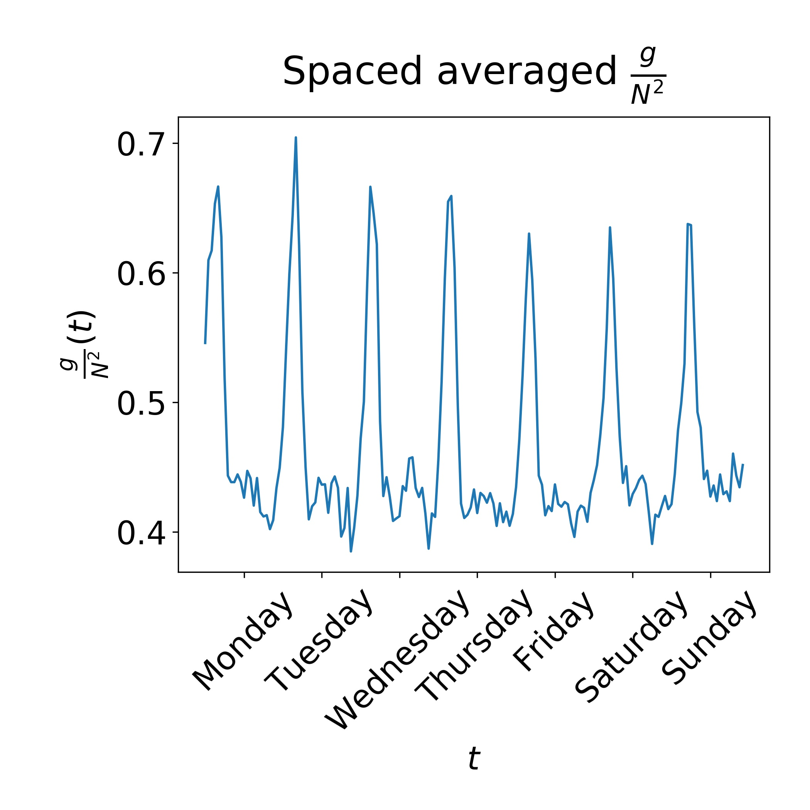
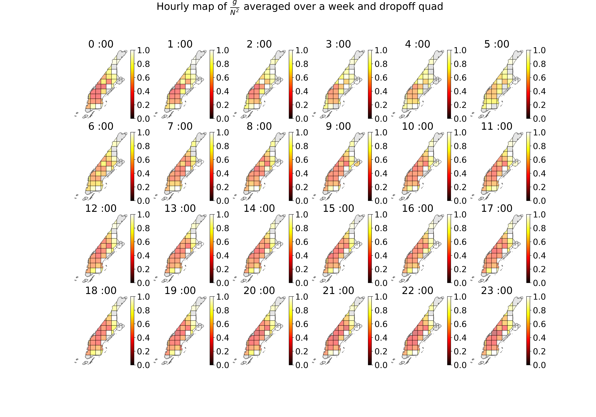
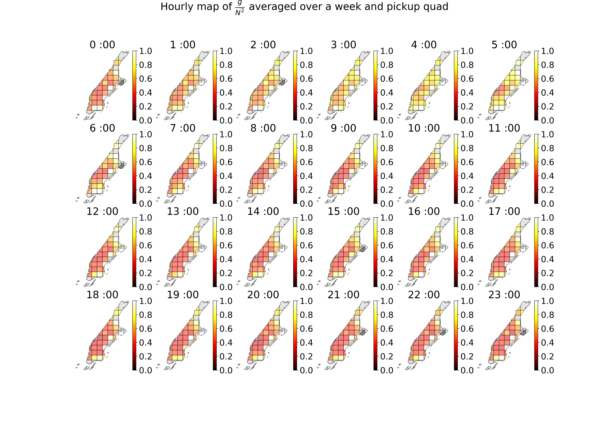

# Estimation of NYC Rides efficiency using 2 point Correlation function

This is a script I wrote as part of application to a transportation company take home task. 
The goal here is to estimate the efficiency of aggregation of rides in Manhattan. 

The data consists of yellow taxi rides info, available at https://www1.nyc.gov/site/tlc/about/tlc-trip-record-data.page

Here I only took into account only the coordinates and the pickup time.
each point consist of a pickup point in (long,lat,time) and drop off point (long,lat). 

In order to assess the efficiency of rides I offer to use as a metric the 2 point correlation function 
 $g_2$ over the following space: $$\vec{r} = (x_p,y_p,x_d,y_d,v_0*t),$$ 
where $x_p,y_p$ and $x_d,y_d$ mark the pickup and dropoff coordinates, and $v_0*t$ is time multiplied by an averaged walking velocity of 4 km/hr. The distance metric is then the Euclidean distance.  (see more in https://en.wikipedia.org/wiki/Correlation_dimension)
   
The 2 point correlation function counts the number of neighbors of a point in neighborhood  $|r|<d$ over all points in a given subspace. This metric varies between $N_{rides}$ to $N_{rides}^2$. 

One way to understand why is to think of the matrix representing the undirected graph where 2 points share a connection if $|r|<d$. If it is a completely connected the number of 1s is $N^2$ but if all points are only connected to themselves with no other neighbors we will get N as a result. 

This means that if the 2 point correlation function is high there are many rides in each others neighborhood (similar pickup and drop off location and similar time of pickup) and they could probably be replaced by one shared ride. 

I was using the following assumptions:

a. Geographical distances are short enough such that $D = R_{earth}\sqrt{\Delta \phi^2+cos^2(\phi)\Delta\lambda^2}$ can be used in order to convert longitute $\lambda$ and latitude $\phi$  and into cartesian coordinates in the plane $(x,y)[km]$

b. The distance $|r|<d$ which I choose as my hyper-parameter is 0.5 kilometers. This is equivalent to walking a maximum distance of 0.5km in the dropoff or pick up or waiting 7.5 minutes for the ride. I choose it as it seems a reasonable requirement for a passenger taking a taxi to avoid further walking or longer wait.

c) I have segmented Manhattan into hourly time slots and geographical subregions on which the function is calculated. While $g_2(d)$ is calculated over points within this region the neighbors my expand beyond the region boundaries (I offer a possibility in the code to calculate only neighbors within the region)


# results
This way I achieved the 2 point correlation function for every segment and hourly time window. 
a common way to normalize it is to devide by $N^2$ so the maximal result would be 1. 

The result is a 3-d array of pickup region drop off region and initial time as axes and value is $C = g_2/N^2$ 

Averaging over all the regions we see a cycle of inefficiency which grows in the morning.


To find which areas are least efficient for pickup averaging over the time and drop off region

To find which areas are least efficient for drop off averaging over the time and drop off region



A nice thing (for my taste as a physicist at least) that can be done with this method is to change the neighborhood size $d$ and to measure the dependency of $C(d)$ and to calculate the fractal dimension of the taxi rides in manhattan.


```python

```
